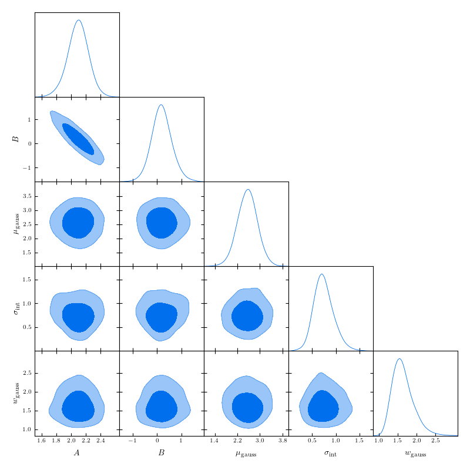
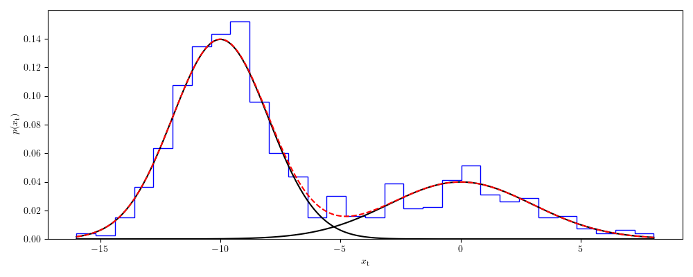
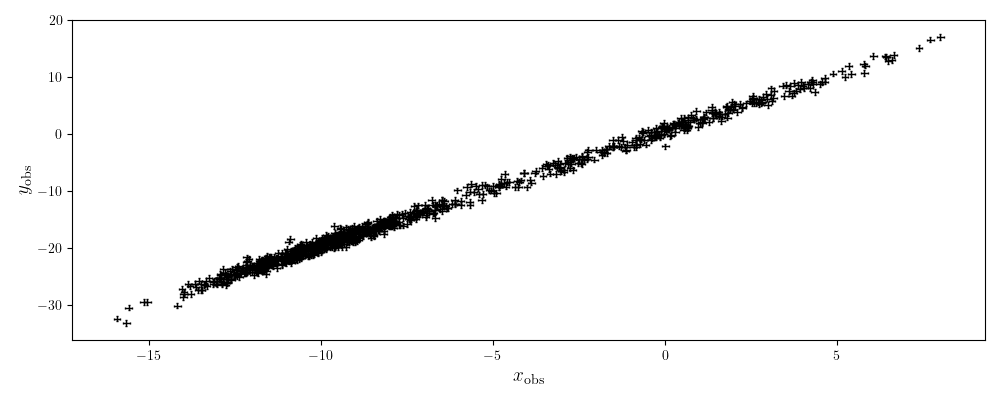

.. default-role:: math

Tutorial
========

In this tutorial we demonstrate how to fit a function to data using both a maximum-likelihood method, and by running a 
MCMC using the ``roxy`` module. We then plot our results. Throughout we call functions with the argument ``method='mnr'`` 
as this is the recommended likelihood for data with x and y errors, however this can be replaced with ``method='uniform'`` 
for an infinite uniform prior on the true x values, or ``method='profile'`` to use the profile likelihood. 
At the end of the tutorial we show how to extend the MNR method to a sum of Gaussians using the arguments
``method='gmm'`` or ``method='kelly'``.
See the MNR paper for more details on these likelihoods and their advantages/disadvantages.

Defining our function
---------------------

We begin by defining a function which we wish to fit. Here we have ``my_fun``, which is simply a straight line, but more complicated functions can be chosen. The function must take two arguments, the first being the independent variable, and the second are the parameters of interest.

.. code-block:: python

	import matplotlib.pyplot as plt
	import numpy as np
	from roxy.regressor import RoxyRegressor
	import roxy.plotting

	def my_fun(x, theta):
            return theta[0] * x + theta[1]

The optimisation and MCMC functionality of ``roxy`` can be accessed by the ``roxy.regressor.RoxyRegressor`` class, which we define here. 
We must supply the names of each of the parameters of ``my_fun``, as well as a fiducial point and the range of the priors (as a dictionary). We assume uniform priors for all parameters.

.. code-block:: python
	
	param_names = ['A', 'B']
	theta0 = [2, 0.5]
	param_prior = {'A':[0, 5], 'B':[-1, 1], 'sig':[0, 3.0]}

	reg = RoxyRegressor(my_fun, param_names, theta0, param_prior)

Mock data generation
--------------------

Let us make some mock data for this function

.. code-block:: python

	nx = 20
	xerr = 0.1
	yerr = 0.5
	sig = 0.5

	np.random.seed(0)

	xtrue = np.linspace(0, 5, nx)
	ytrue = reg.value(xtrue, theta0)
	xobs = xtrue + np.random.normal(size=len(xtrue)) * xerr
	yobs = ytrue + np.random.normal(size=len(xtrue)) * np.sqrt(yerr ** 2 + sig ** 2)

	plot_kwargs = {'fmt':'.', 'markersize':1, 'zorder':1,
			 'capsize':1, 'elinewidth':1.0, 'color':'k', 'alpha':1}
	plt.errorbar(xobs, yobs, xerr=xerr, yerr=yerr, **plot_kwargs)
	plt.xlabel(r'$x_{\rm obs}$', fontsize=14)
	plt.ylabel(r'$y_{\rm obs}$', fontsize=14)
	plt.tight_layout()

.. image:: data.png
	:width: 480px

Maximum likelihood estimation
-----------------------------

We begin by finding the maximum likelihood point, which is as simple as

.. code-block:: python

	res = reg.optimise(param_names, xobs, yobs, [xerr, yerr], method='mnr')

.. code-block:: console

	Optimisation Results:
	A:	2.0954216640049674
	B:	0.18122108584201763
	sig:	0.6317666884191426
	mu_gauss:	2.55679814495946
	w_gauss:	1.4818831988725527

Note that ``res`` here is a ``scipy.optimize._optimize.OptimizeResult`` object, so you can use all the usual functionality this contains.

Markov chain Monte Carlo
------------------------

We will now run a MCMC. This uses the NUTS sampler from ``numpyro`` which is incredibly fast. We choose to use 700 warmup steps and take 5000 samples. We see that the result reports 3613.66 iterations per second, so this MCMC takes less than 2 seconds to run! 

We print the parameter mean and median values, their standard deviations, the 5% and 95% bounds, the number of effective samples and the Gelman-Rubin statistic.

.. code-block:: python

	nwarm, nsamp = 700, 5000
	samples = reg.mcmc(param_names, xobs, yobs, [xerr, yerr], nwarm, nsamp, method=method)

.. code-block:: console

	Running MCMC
	sample: 100%|██████████| 5700/5700 [00:01<00:00, 3613.66it/s, 15 steps of size 2.90e-01. acc. prob=0.91]

			mean       std    median      5.0%     95.0%     n_eff     r_hat
		 A      2.09      0.14      2.09      1.85      2.32   3015.95      1.00
		 B      0.19      0.43      0.19     -0.54      0.86   3116.20      1.00
	  mu_gauss      2.55      0.36      2.55      1.98      3.16   3593.55      1.00
	       sig      0.75      0.21      0.73      0.40      1.08   3024.35      1.00
	   w_gauss      1.63      0.28      1.59      1.20      2.09   3000.74      1.00

	Number of divergences: 0

We now plot the results. The trace plot gives the sample value as a function of MCMC step, the triangle plot gives the one- and two-dimensional posterior distributions, and the posterior predictive plot gives the predicted function values at 1, 2 and 3 sigma confidence.
These plots make use of the `arviz <https://www.arviz.org/en/latest/>`_, `getdist <https://getdist.readthedocs.io/en/latest/>`_ and `fgivenx <https://fgivenx.readthedocs.io/en/latest/?badge=latest>`_ modules, respectively. We also have functionality to produce triangle plots with the `corner <https://corner.readthedocs.io/en/latest/>`_ module (by replacing ``module='getdist'`` with ``module='corner'`` in ``roxy.plotting.triangle_plot``).

.. code-block:: python

	roxy.plotting.trace_plot(samples, to_plot='all')
	roxy.plotting.triangle_plot(samples, to_plot='all', module='getdist', param_prior=param_prior)
	roxy.plotting.posterior_predictive_plot(reg, samples, xobs, yobs, xerr, yerr) 

.. image:: trace.png
        :width: 480px

.. image:: posterior_predictive.png
        :width: 480px

Gaussian Mixture Models
------------------------

We now consider a case where a single Gaussian is not sufficient to characterise the distribution of the true x values,
and so we resort to a Gaussian mixture model. In this case we must fit the distribution

.. math::

	P (x_{\rm t}) = \sum_{i=0}^{n_{\rm gauss}-1}{\frac{\nu_i}{\sqrt{2 \pi w_i^2}} \exp \left( - \frac{\left(x_{\rm t} - \mu_i \right)^2}{2 w_i^2} \right)},

where we have a set of weights, means a variances which we must fit. This can be achieved by using ``method='gmm'`` in ``roxy`` functions.

As an example, let us create some mock data from a two-component Gaussian mixture

.. code-block:: python

	import numpy as np

	np.random.seed(0)	

	nx = 1000

	# Draw the samples from a two Gaussian model
	true_weights = np.array([0.7, 0.3])
	true_means = [-10.0, 0.0]
	true_w = [2, 3]

	which_gauss = np.random.uniform(0, 1, nx)
	p = np.array([0] + list(true_weights))
	p = np.cumsum(p)
	xtrue = np.empty(nx)
	for i in range(len(true_means)):
	    m = (which_gauss >= p[i]) & (which_gauss < p[i+1])
	    print(i, m.sum())
	    xtrue[m] = np.random.normal(true_means[i], true_w[i], m.sum())	

Plotting the distribution, we see this is highly non-Gaussian

.. code-block:: python

	import matplotlib.pyplot as plt

	fig, ax = plt.subplots(1, 1, figsize=(10,4))
	ax.hist(xtrue, bins=30, density=True, histtype='step', color='b')
	x = np.linspace(xtrue.min(), xtrue.max(), 300)
	ysum = np.zeros(len(x))
	for nu, mu, w in zip(true_weights, true_means, true_w):
	    y = nu / np.sqrt(2 * np.pi * w ** 2) * np.exp(- (x - mu) ** 2 / (2 * w ** 2))
	    ysum += y
	    ax.plot(x, y, color='k')
	ax.plot(x, ysum, color='r', ls='--')
	ax.set_xlabel(r'$x_{\rm t}$')
	ax.set_ylabel(r'$p(x_{\rm t})$')
	fig.tight_layout()
	plt.show()

We then (as before) assume that these data given rise to y values which obey a straight line, so create mock data

.. code-block:: python 

	from roxy.regressor import RoxyRegressor

	def my_fun(x, theta):
    	    return theta[0] * x + theta[1]
	
	param_names = ['A', 'B']
	theta0 = [2, 0.5]
	param_prior = {'A':[0, 5], 'B':[-2, 2], 'sig':[0, 3.0]}
	xerr = 0.1
	yerr = 0.5
	sig = 0.5

	reg = RoxyRegressor(my_fun, param_names, theta0, param_prior)

	ytrue = reg.value(xtrue, theta0)
	xobs = xtrue + np.random.normal(size=len(xtrue)) * xerr
	yobs = ytrue + np.random.normal(size=len(xtrue)) * np.sqrt(yerr ** 2 + sig ** 2)

Which we then plot

.. code-block:: python

	plot_kwargs = {'fmt':'.', 'markersize':1, 'zorder':1,
                 'capsize':1, 'elinewidth':1.0, 'color':'k', 'alpha':1}
	plt.errorbar(xobs, yobs, xerr=xerr, yerr=yerr, **plot_kwargs)
	plt.xlabel(r'$x_{\rm obs}$', fontsize=14)
	plt.ylabel(r'$y_{\rm obs}$', fontsize=14)
	plt.tight_layout()
	plt.show()

Finally, we can run the same functions as before but with the ``method='gmm'`` argument to optimise or
run a MCMC. Note that we have to use the argument ``ngauss=2`` if we want to fit using two Gaussians.
For example, running

.. code-block:: python
	
	import roxy.plotting

	nwarm, nsamp = 700, 5000
        samples = reg.mcmc(param_names, xobs, yobs, [xerr, yerr], nwarm, nsamp, method='gmm', ngauss=2)
	roxy.plotting.triangle_plot(samples, to_plot='all', module='getdist', param_prior=param_prior, show=True)

yields 

.. code-block:: console

	Optimisation Results:
	A:	2.007291078567505
	B:	0.5517559051513672
	sig:	0.49039560556411743
	mu_gauss_0:	0.048832207918167114
	mu_gauss_1:	-7.254714488983154
	w_gauss_0:	0.3939739465713501
	w_gauss_1:	4.932014465332031
	weight_gauss_0:	0.023076239973306656
	3222.376708984375
	

	Running MCMC
	sample: 100%|██████████████████| 5700/5700 [00:05<00:00, 1078.21it/s, 7 steps of size 3.14e-01. acc. prob=0.94]

			 mean       std    median      2.5%     97.5%     n_eff     r_hat
		  A      2.00      0.00      2.00      1.99      2.01   3763.48      1.00
		  B      0.51      0.04      0.51      0.43      0.59   3444.97      1.00
	mu_gauss[0]    -10.00      0.09    -10.01    -10.17     -9.83   3822.16      1.00
	mu_gauss[1]     -0.22      0.27     -0.21     -0.76      0.29   3426.68      1.00
		sig      0.49      0.02      0.49      0.44      0.54   4186.86      1.00
	 w_gauss[0]      1.86      0.06      1.86      1.74      1.99   3359.74      1.00
	 w_gauss[1]      3.26      0.21      3.25      2.88      3.68   3499.39      1.00
	 weights[0]      0.70      0.02      0.70      0.66      0.73   3768.39      1.00
	 weights[1]      0.30      0.02      0.30      0.27      0.34   3768.39      1.00

and

.. image:: gmm_corner.png
        :width: 600px

Instead of using uniform priors on the GMM components, one can use the priors suggested in Kelly 2007. This introduces
three further parameters $\mu_\star$, $w_\star^2$ and $u_\star^2$ which specify the priors and which we also have
to sample. This is achieved by replacing ``method='gmm'`` with ``method='kelly'`` in the MCMC or the optimisation
functions. 

A priori, we may not know how many Gaussians to use. For this case, we provide a function ``find_best_gmm`` as part of the
``roxy.RoxyRegressor`` class, which can iterate through some number of Gaussians, and compare the best through either the
AIC or BIC. For example, with these data, we can check to see whether we should use 1, 2 or 3 Gaussians

.. code-block:: python

	max_ngauss = 3
	reg.find_best_gmm(param_names, xobs, yobs, xerr, yerr, max_ngauss, best_metric='BIC', nwarm=100, nsamp=100)

which gives (alongside some other output)

.. code-block:: console

	Best ngauss according to BIC: 2
	1 555.9282
	2 0.0
	3 18.67041

so, indeed, 2 Gaussians are preferred.

Note that we specified ``nwarm`` and ``nsamp``. This is because we run a short MCMC at each parameter optimisation step
to give us a better initial starting point to run our optimiser. These values can be set to small numbers, as we do not 
care about sampling the distribution well, but only getting a good initial guess.

