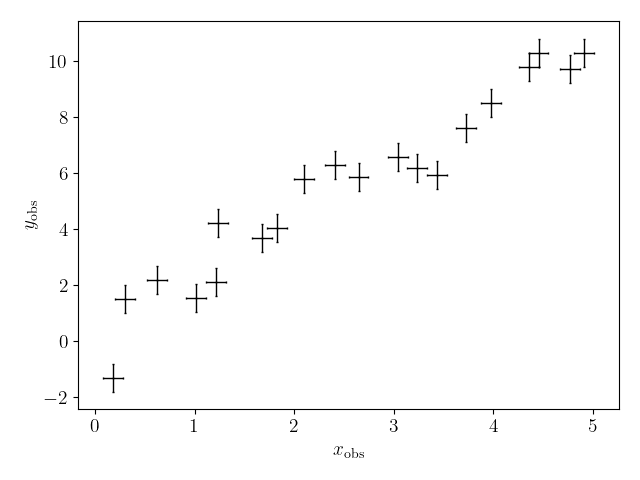
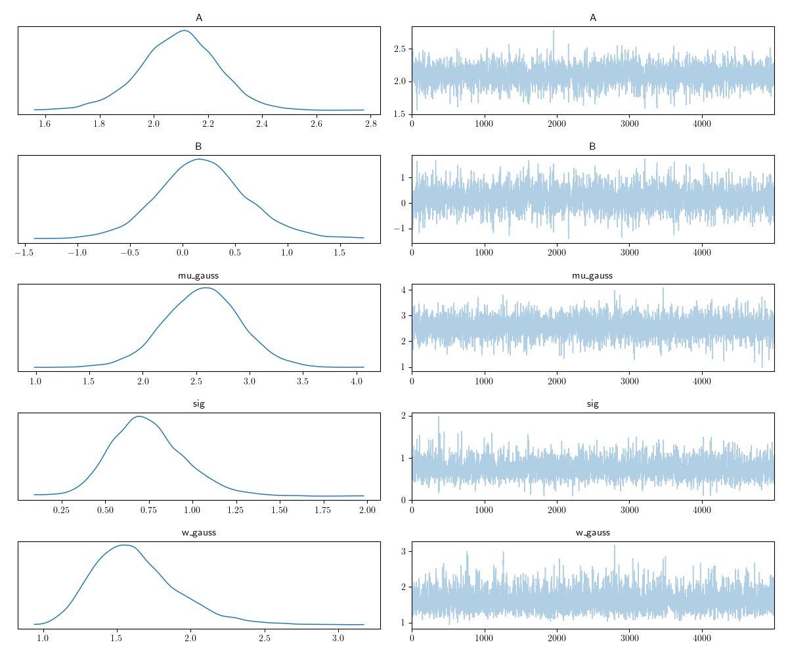
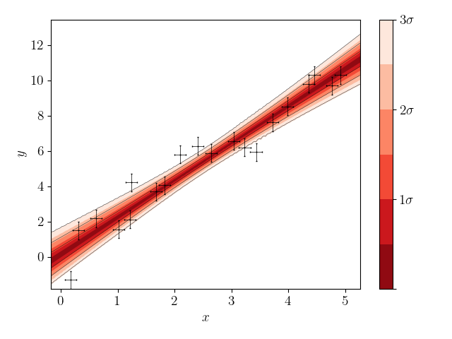
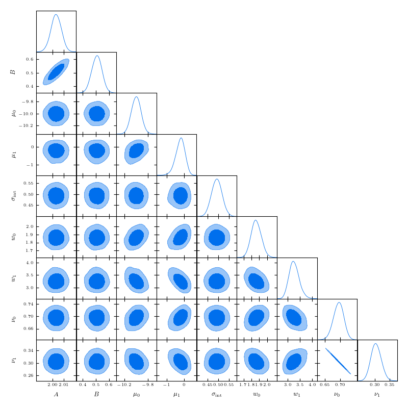
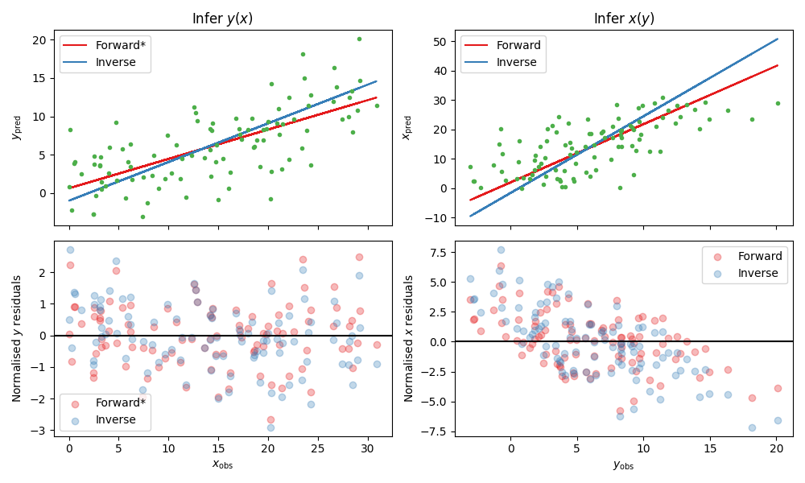

.. default-role:: math

Tutorial
========

In this tutorial we demonstrate how to fit a function to data using both a maximum-likelihood method, and by running a 
MCMC using the ``roxy`` module. We then plot our results. 

To start with, we call functions with the argument ``method='mnr'`` 
as this is the simplest recommended likelihood for data with x and y errors, however this can be replaced with ``method='unif'`` 
for an infinite uniform prior on the true x values, or ``method='prof'`` to use the profile likelihood. 
In the presence of x-errors, the profile method is accurate in the absence of intrinsic scatter and the 
unif method able to recover intrinsic scatter, however MNR is the only method that is approximately unbiased in all the regression parameters.

Next, we show how to extend the MNR method to a sum of Gaussians using the argument
``method='gmm'``.
Given that the user will not know whether more than one Gaussian is appropriate a priori, we recommend
going through this section and applying these methods to your dataset. We leave this to the end of the
tutorial, however, so that you can get used to ``roxy``'s features before worrying about the choice
of likelihood.

Please see the `MNR paper <https://arxiv.org/abs/2309.00948>`_ for more details on these likelihoods and their advantages/disadvantages.

We provide a note about the reproducibility of the tutorial results at the end of the tutorial.

Defining our function
---------------------

We begin by defining a function which we wish to fit. Here we have ``my_fun``, which is simply a straight line, but more complicated functions can be chosen. The function must take two arguments, the first being the independent variable, and the second are the parameters of interest.

.. code-block:: python

	import matplotlib.pyplot as plt
	import numpy as np
	from roxy.regressor import RoxyRegressor
	import roxy.plotting

	def my_fun(x, theta):
            return theta[0] * x + theta[1]

The optimisation and MCMC functionality of ``roxy`` can be accessed by the ``roxy.regressor.RoxyRegressor`` class, which we define here. 
We must supply the names of each of the parameters of ``my_fun``, as well as a fiducial point and the range of the priors (as a dictionary). We assume uniform priors for all parameters.
If you wish to set improper uniform priors without edges on an parameter, simply include ``None`` in one of the entries of the prior for that parameter.

.. code-block:: python
	
	param_names = ['A', 'B']
	theta0 = [2, 0.5]
	param_prior = {'A':[0, 5], 'B':[-2, 2], 'sig':[0, 3.0]}

	reg = RoxyRegressor(my_fun, param_names, theta0, param_prior)

Mock data generation
--------------------

Let us make some mock data from this function

.. code-block:: python

	nx = 20
	xerr = 0.1
	yerr = 0.5
	sig = 0.5

	np.random.seed(0)

	xtrue = np.linspace(0, 5, nx)
	ytrue = reg.value(xtrue, theta0)
	xobs = xtrue + np.random.normal(size=len(xtrue)) * xerr
	yobs = ytrue + np.random.normal(size=len(xtrue)) * np.sqrt(yerr ** 2 + sig ** 2)

	plot_kwargs = {'fmt':'.', 'markersize':1, 'zorder':1,
			 'capsize':1, 'elinewidth':1.0, 'color':'k', 'alpha':1}
	plt.errorbar(xobs, yobs, xerr=xerr, yerr=yerr, **plot_kwargs)
	plt.xlabel(r'$x_{\rm obs}$', fontsize=14)
	plt.ylabel(r'$y_{\rm obs}$', fontsize=14)
	plt.tight_layout()

Maximum likelihood estimation
-----------------------------

We begin by finding the maximum likelihood point, which is as simple as

.. code-block:: python

	res = reg.optimise(param_names, xobs, yobs, [xerr, yerr], method='mnr')

.. code-block:: console

	Optimisation Results:
	A:	2.085973024368286
	B:	0.20573419332504272
	sig:	0.6321122646331787

Note that ``res`` here is a ``scipy.optimize._optimize.OptimizeResult`` object, so you can use all the usual functionality this contains.

In this example, we optimised all the parameters. If, instead, we just wished to only find the gradient,
we could have used ``['A']`` instead of ``param_names``, and then the intercept would be fixed to the default value in
``theta0`` which we gave when initialising the regressor object (so in this case 0.5). We can also choose
to assume no intrinsic scatter by using the argument ``infer_intrinsic=False`` when calling ``reg.optimise``.

Markov chain Monte Carlo
------------------------

We will now run a MCMC. This uses the NUTS sampler from ``numpyro`` which is incredibly fast. We choose to use 700 warmup steps and take 5000 samples. We see that the result reports 3613.66 iterations per second, so this MCMC takes less than 2 seconds to run! 

We print the parameter mean and median values, their standard deviations, the 5% and 95% bounds, the number of effective samples and the Gelman-Rubin statistic.

.. code-block:: python

	nwarm, nsamp = 700, 5000
	samples = reg.mcmc(param_names, xobs, yobs, [xerr, yerr], nwarm, nsamp, method='mnr')

.. code-block:: console

	Running MCMC
	sample: 100%|█████████████████████████████| 5700/5700 [00:02<00:00, 2665.71it/s, 15 steps of size 3.42e-01. acc. prob=0.91]

			mean       std    median      2.5%     97.5%     n_eff     r_hat
		 A      2.09      0.14      2.10      1.80      2.38   2221.65      1.00
		 B      0.19      0.43      0.18     -0.65      1.06   2116.94      1.00
	  mu_gauss      2.56      0.36      2.56      1.83      3.24   3358.24      1.00
	       sig      0.74      0.22      0.73      0.36      1.19   2870.27      1.00
	   w_gauss      1.63      0.29      1.59      1.11      2.18   3327.07      1.00

	Number of divergences: 0

In this example we chose to use ``method='mnr'``, but this can be any one of 'mnr', 'gmm', 'unif' or 'prof'. See ``roxy.likelihoods`` and the MNR paper for more details of the choice of likelihood.

We now plot the results. The trace plot gives the sample value as a function of MCMC step, the triangle plot gives the one- and two-dimensional posterior distributions, and the posterior predictive plot gives the predicted function values at 1, 2 and 3 sigma confidence.
These plots make use of the `arviz <https://www.arviz.org/en/latest/>`_, `getdist <https://getdist.readthedocs.io/en/latest/>`_ and `fgivenx <https://fgivenx.readthedocs.io/en/latest/?badge=latest>`_ modules, respectively. We also have functionality to produce triangle plots with the `corner <https://corner.readthedocs.io/en/latest/>`_ module (by replacing ``module='getdist'`` with ``module='corner'`` in ``roxy.plotting.triangle_plot``).

.. code-block:: python

	roxy.plotting.trace_plot(samples, to_plot='all')
	roxy.plotting.triangle_plot(samples, to_plot='all', module='getdist', param_prior=param_prior)
	roxy.plotting.posterior_predictive_plot(reg, samples, xobs, yobs, xerr, yerr) 

.. image:: triangle.png
        :width: 480px

Again, in this case we sampled all the parameters. If, instead, we just wished to just sample the gradient,
we could have passed ``['A']`` for ``param_names``, and then the intercept would be fixed to the default value in
``theta0`` which we gave when initialising the regressor object (so in this case 0.5). We can also choose
to assume no intrinsic scatter by using the argument ``infer_intrinsic=False`` when calling ``reg.mcmc``.

Gaussian Mixture Models
------------------------

We now consider a case where a single Gaussian is not sufficient to characterise the distribution of the true x values,
and so we resort to a Gaussian mixture model. 
In the `MNR paper <https://arxiv.org/abs/2309.00948>`_ we study the effect of using multiple Gaussians and find that
it can sometimes reduce biases.
In this case we must fit the distribution

.. math::

	P (x_{\rm t}) = \sum_{i=0}^{n_{\rm gauss}-1}{\frac{\nu_i}{\sqrt{2 \pi w_i^2}} \exp \left( - \frac{\left(x_{\rm t} - \mu_i \right)^2}{2 w_i^2} \right)},

where we have a set of weights, means a variances which we must fit. This can be achieved by using ``method='gmm'`` in ``roxy`` functions.

As an example, let us create some mock data from a two-component Gaussian mixture

.. code-block:: python

	import numpy as np

	np.random.seed(0)	

	nx = 1000

	# Draw the samples from a two Gaussian model
	true_weights = np.array([0.7, 0.3])
	true_means = [-10.0, 0.0]
	true_w = [2, 3]

	which_gauss = np.random.uniform(0, 1, nx)
	p = np.array([0] + list(true_weights))
	p = np.cumsum(p)
	xtrue = np.empty(nx)
	for i in range(len(true_means)):
	    m = (which_gauss >= p[i]) & (which_gauss < p[i+1])
	    print(i, m.sum())
	    xtrue[m] = np.random.normal(true_means[i], true_w[i], m.sum())	

Plotting the distribution, we see this is highly non-Gaussian

.. code-block:: python

	import matplotlib.pyplot as plt
	import matplotlib as mpl
	mpl.rcParams['text.usetex'] = True

	fig, ax = plt.subplots(1, 1, figsize=(10,4))
	ax.hist(xtrue, bins=30, density=True, histtype='step', color='b')
	x = np.linspace(xtrue.min(), xtrue.max(), 300)
	ysum = np.zeros(len(x))
	for nu, mu, w in zip(true_weights, true_means, true_w):
	    y = nu / np.sqrt(2 * np.pi * w ** 2) * np.exp(- (x - mu) ** 2 / (2 * w ** 2))
	    ysum += y
	    ax.plot(x, y, color='k')
	ax.plot(x, ysum, color='r', ls='--')
	ax.set_xlabel(r'$x_{\rm t}$')
	ax.set_ylabel(r'$p(x_{\rm t})$')
	fig.tight_layout()
	plt.show()

.. image:: gmm_distribution.png
        :width: 480px

We then (as before) assume that these data given rise to y values which obey a straight line, so create mock data

.. code-block:: python 

	from roxy.regressor import RoxyRegressor

	def my_fun(x, theta):
    	    return theta[0] * x + theta[1]
	
	param_names = ['A', 'B']
	theta0 = [2, 0.5]
	param_prior = {'A':[0, 5], 'B':[-2, 2], 'sig':[0, 3.0]}
	xerr = 0.1
	yerr = 0.5
	sig = 0.5

	reg = RoxyRegressor(my_fun, param_names, theta0, param_prior)

	ytrue = reg.value(xtrue, theta0)
	xobs = xtrue + np.random.normal(size=len(xtrue)) * xerr
	yobs = ytrue + np.random.normal(size=len(xtrue)) * np.sqrt(yerr ** 2 + sig ** 2)

Which we then plot

.. code-block:: python

	plot_kwargs = {'fmt':'.', 'markersize':1, 'zorder':1,
                 'capsize':1, 'elinewidth':1.0, 'color':'k', 'alpha':1}
	plt.errorbar(xobs, yobs, xerr=xerr, yerr=yerr, **plot_kwargs)
	plt.xlabel(r'$x_{\rm obs}$', fontsize=14)
	plt.ylabel(r'$y_{\rm obs}$', fontsize=14)
	plt.tight_layout()
	plt.show()

.. image:: gmm_data.png
        :width: 480px

Finally, we can run the same functions as before but with the ``method='gmm'`` argument to optimise or run a MCMC.
Note that we have to use the argument ``ngauss=2`` if we want to fit using two Gaussians.
We need to choose a prior for the parameters of the GMM, which is controlled by the argument ``gmm_prior``.
If you use ``gmm_prior='uniform'``, then a uniform prior is placed on the means and widths of the GMM componenets.
Instead if you use ``gmm_prior='hierarchical'``, then the means and width have a Gaussian and Inverse Gamma prior, respectively. The hyper-parameters controlling these priors are drawn from Uniform or Inverse Gamma distributions (see the paper for more details).
This introduces
three further parameters which specify the priors, which we also have to sample.
For example, running

.. code-block:: python
	
	import roxy.plotting

	nwarm, nsamp = 700, 5000
        samples = reg.mcmc(param_names, xobs, yobs, [xerr, yerr], nwarm, nsamp, method='gmm', ngauss=2, gmm_prior='uniform')
	roxy.plotting.triangle_plot(samples, to_plot='all', module='getdist', param_prior=param_prior, show=True)

yields 

.. code-block:: console

	Running MCMC
	sample: 100%|██████████████████████████████| 5700/5700 [00:06<00:00, 898.22it/s, 15 steps of size 3.22e-01. acc. prob=0.94]

			 mean       std    median      2.5%     97.5%     n_eff     r_hat
		  A      2.00      0.00      2.00      1.99      2.01   4206.88      1.00
		  B      0.51      0.04      0.51      0.43      0.58   3916.77      1.00
	mu_gauss[0]    -10.00      0.08    -10.00    -10.17     -9.85   3809.84      1.00
	mu_gauss[1]     -0.22      0.27     -0.20     -0.78      0.28   3374.51      1.00
		sig      0.49      0.02      0.49      0.45      0.54   4462.18      1.00
	 w_gauss[0]      1.86      0.06      1.86      1.73      1.99   3811.61      1.00
	 w_gauss[1]      3.26      0.21      3.25      2.87      3.68   3498.38      1.00
	 weights[0]      0.70      0.02      0.70      0.66      0.73   4183.47      1.00
	 weights[1]      0.30      0.02      0.30      0.27      0.34   4183.47      1.00

	Number of divergences: 0

and

A priori, we may not know how many Gaussians to use. For this case, we provide a function ``find_best_gmm`` as part of the
``roxy.RoxyRegressor`` class, which can iterate through some number of Gaussians, and compare the best through either the
AIC or BIC. For example, with these data, we can check to see whether we should use 1, 2 or 3 Gaussians

.. code-block:: python

	max_ngauss = 3
	np.random.seed(42)
	reg.find_best_gmm(param_names, xobs, yobs, xerr, yerr, max_ngauss, best_metric='BIC', nwarm=100, nsamp=100, gmm_prior='uniform')

which gives (alongside some other output)

.. code-block:: console

	Best ngauss according to BIC: 2
	1 555.8955078125
	2 0.0
	3 22.76904296875

so, indeed, 2 Gaussians are preferred.

Note that we specified ``nwarm`` and ``nsamp``. This is because we run a short MCMC at each parameter optimisation step
to give us a better initial starting point to run our optimiser. These values can be set to small numbers, as we do not 
care about sampling the distribution well, but only getting a good initial guess.

Direction of causality
----------------------

A property of the likelihoods used in ``roxy`` is asymmetry with respect to :math:`x` and :math:`y`, 
so that the regression results depend on which variable is considered independent. 
The result is most reliable when the direction of regression matches the direction of causality in the system under investigation.
This may be assessed by treating the scatter of the points around the best-fit line as an additive noise model.
In this case, the independent variable may be identified as the one that has least correlation with the residuals of the fit.

The ``roxy`` function ``roxy.causality.assess_causality`` fits both the forward and inverse relations to the dataset, 
produces plots of the data in both directions with both regression models overlaid and the corresponding normalised 
residuals plotted against the independent variable, and calculates a correlation coefficient (Spearman, Pearson or HSIC).
The default choice is HSIC (Hilbert-Schmidt Independence Criterion) because this was used in the original paper 
`(Hoyer et al. 2008) <https://papers.nips.cc/paper_files/paper/2008/hash/f7664060cc52bc6f3d620bcedc94a4b6-Abstract.html>`_
introducing the additive noise model.
This method has been shown to be highly reliable 
`(Mooij et al. 2014) <https://arxiv.org/abs/1412.3773>`_.
From these coefficients ``roxy`` makes a recommendation as to which variable to treat as independent and which dependent 
(which may require renaming the input arrays before performing the regression).
We normalise the residuals by the square root of the 
sum of the dependent variable's error squared and the intrinsic scatter squared
so that the results are not dominated by points with large uncertainties.

For example, let us create some mock data in the case where we know that :math:`y` is the dependent variable.

.. code-block:: python

	import numpy as np
	from roxy.regressor import RoxyRegressor

	def my_fun(x, theta):
	    return theta[0] * x + theta[1]

	param_names = ['A', 'B']
	theta0 = [0.4, 1.0]
	param_prior = {'A':[0, 5], 'B':[-2, 2], 'sig':[0, 3.0]}

	reg = RoxyRegressor(my_fun, param_names, theta0, param_prior)

	nx = 100
	xerr = np.random.normal(1, 0.2, nx)
	yerr = np.random.normal(2, 0.2, nx)
	xerr[xerr<0]=0
	yerr[yerr<0]=0
	sig = 3.0

	np.random.seed(0)

	xtrue = np.random.uniform(0, 30, nx)
	ytrue = reg.value(xtrue, theta0)
	xobs = xtrue + np.random.normal(size=len(xtrue)) * xerr
	yobs = ytrue + np.random.normal(size=len(xtrue)) * np.sqrt(yerr ** 2 + sig ** 2)

To do the inverse fits, we need to define the inverse function. I.e. if ``my_fun`` above gives
:math:`y = f(x, \theta)`, then we need the function :math:`x = g(y, \theta)`, which for this case is

.. code-block:: python

	def fun_inv(y, theta):
	    return y / theta[0] - theta[1] / theta[0]

We now call the function ``roxy.causality.assess_causality``

.. code-block:: python

	import roxy.causality
	roxy.causality.assess_causality(my_fun, fun_inv, xobs, yobs, [xerr, yerr], 
					param_names, theta0, param_prior, method='mnr',
					criterion='hsic')

which gives the output

.. code-block:: console

	Fitting y vs x

	Optimisation Results:
	A:	0.38329729437828064
	B:	0.6116797924041748
	sig:	2.8931143283843994
	mu_gauss:	14.385257720947266
	w_gauss:	8.616861343383789

	Fitting x vs y

	Optimisation Results:
	A:	1.9811209440231323
	B:	2.0
	sig:	3.0
	mu_gauss:	6.214134216308594
	w_gauss:	4.011857032775879

	y(x) forward HSIC: 0.159, (p=0.898)

	y(x) inverse HSIC: 0.655, (p=0.03)

	x(y) forward HSIC: 0.772, (p=0.005)

	x(y) inverse HSIC: 2.342, (p<0.001)

	Recommended direction: y(x)

and the figure

From the correlation coefficients, we see that fitting :math:`y(x)` in the forward
direction is the best option, and thus in the plot this option is starred (and is correct).
We caution however that the correlations may be non-monotonic and/or nonlinear, and therefore 
recommend picking the regression direction that visually produces the lowest correlation in the residuals, 
only resorting to the quantitative correlation coefficients in close cases.
We also caution that the test is more accurate the larger :math:`\sigma_{\rm int}^2 + \sigma_y^2` is relative to `\sigma_x^2`,
and may be unreliable in the opposite regime.

Reproducibility
---------------

This tutorial was run using MacOS with a M2 chip. We have found that the results reported can
marginally vary between architectures or between package versions of the dependenices of ``roxy``.
Such changes are small, e.g. the fourth decimal place of an optimisation result may differ,
so if there are minor differences between the above results and what you find, there is no reason
to be concerned! For completeness, below we give the exact conda environment we used to obtain these
results.

.. code-block:: yaml

	name: roxy_env
	channels:
	  - conda-forge
	  - defaults
	dependencies:
	  - bzip2=1.0.8=h0d85af4_4
	  - c-ares=1.20.1=h10d778d_0
	  - ca-certificates=2023.7.22=h8857fd0_0
	  - importlib-metadata=6.8.0=pyha770c72_0
	  - importlib_metadata=6.8.0=hd8ed1ab_0
	  - jax=0.4.16=pyhd8ed1ab_0
	  - jaxlib=0.4.14=cpu_py311hb9eea52_1
	  - libabseil=20230802.1=cxx17_h048a20a_0
	  - libblas=3.9.0=18_osx64_openblas
	  - libcblas=3.9.0=18_osx64_openblas
	  - libcxx=16.0.6=hd57cbcb_0
	  - libexpat=2.5.0=hf0c8a7f_1
	  - libffi=3.4.2=h0d85af4_5
	  - libgfortran=5.0.0=13_2_0_h97931a8_1
	  - libgfortran5=13.2.0=h2873a65_1
	  - libgrpc=1.58.1=hecc90c7_2
	  - liblapack=3.9.0=18_osx64_openblas
	  - libopenblas=0.3.24=openmp_h48a4ad5_0
	  - libprotobuf=4.24.3=he0c2237_1
	  - libre2-11=2023.06.02=h4694dbf_0
	  - libsqlite=3.43.2=h92b6c6a_0
	  - libzlib=1.2.13=h8a1eda9_5
	  - llvm-openmp=17.0.2=hff08bdf_0
	  - ml_dtypes=0.3.1=py311h1eadf79_1
	  - ncurses=6.4=hf0c8a7f_0
	  - numpy=1.26.0=py311hc44ba51_0
	  - openssl=3.1.3=h8a1eda9_0
	  - opt-einsum=3.3.0=hd8ed1ab_2
	  - opt_einsum=3.3.0=pyhc1e730c_2
	  - pip=23.2.1=pyhd8ed1ab_0
	  - python=3.11.4=h30d4d87_0_cpython
	  - python_abi=3.11=4_cp311
	  - re2=2023.06.02=hd34609a_0
	  - readline=8.2=h9e318b2_1
	  - scipy=1.11.3=py311h16c3c4d_1
	  - setuptools=68.2.2=pyhd8ed1ab_0
	  - tk=8.6.13=hef22860_0
	  - wheel=0.41.2=pyhd8ed1ab_0
	  - xz=5.2.6=h775f41a_0
	  - zipp=3.17.0=pyhd8ed1ab_0
	  - pip:
	      - alabaster==0.7.13
	      - arviz==0.16.1
	      - babel==2.13.0
	      - certifi==2023.7.22
	      - charset-normalizer==3.3.0
	      - contourpy==1.1.1
	      - corner==2.2.2
	      - cycler==0.12.1
	      - docutils==0.18.1
	      - fgivenx==2.4.2
	      - fonttools==4.43.1
	      - getdist==1.4.5
	      - h5netcdf==1.2.0
	      - h5py==3.10.0
	      - idna==3.4
	      - imagesize==1.4.1
	      - jaxopt==0.8.1
	      - jinja2==3.1.2
	      - joblib==1.3.2
	      - kiwisolver==1.4.5
	      - markdown-it-py==3.0.0
	      - markupsafe==2.1.3
	      - matplotlib==3.8.0
	      - mdit-py-plugins==0.4.0
	      - mdurl==0.1.2
	      - multipledispatch==1.0.0
	      - myst-parser==2.0.0
	      - numpyro==0.13.2
	      - packaging==23.2
	      - pandas==2.1.1
	      - pillow==10.0.1
	      - prettytable==3.9.0
	      - pygments==2.16.1
	      - pyparsing==3.1.1
	      - python-dateutil==2.8.2
	      - pytz==2023.3.post1
	      - pyyaml==6.0.1
	      - requests==2.31.0
	      - scikit-learn==1.3.1
	      - six==1.16.0
	      - snowballstemmer==2.2.0
	      - sphinx==7.2.6
	      - sphinx-rtd-theme==1.3.0
	      - sphinxcontrib-applehelp==1.0.7
	      - sphinxcontrib-devhelp==1.0.5
	      - sphinxcontrib-htmlhelp==2.0.4
	      - sphinxcontrib-jquery==4.1
	      - sphinxcontrib-jsmath==1.0.1
	      - sphinxcontrib-qthelp==1.0.6
	      - sphinxcontrib-serializinghtml==1.1.9
	      - threadpoolctl==3.2.0
	      - tqdm==4.66.1
	      - typing-extensions==4.8.0
	      - tzdata==2023.3
	      - urllib3==2.0.6
	      - wcwidth==0.2.8
	      - xarray==2023.9.0
	      - xarray-einstats==0.6.0

